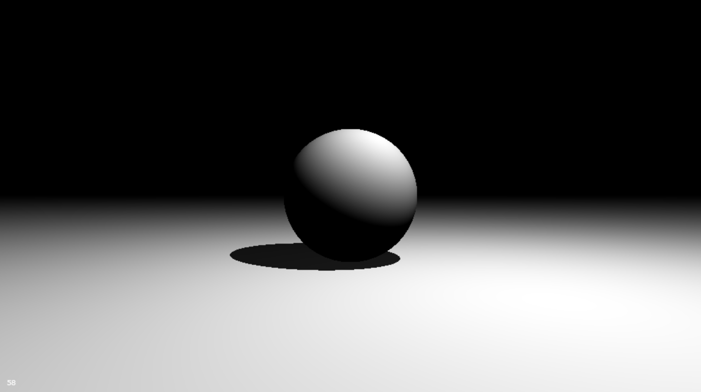

# Speelgrond

**Speelgrond is a screen shader playground with python scripting and hot-reloading** 

Think **[shadertoy](https://www.shadertoy.com/)**  but with python scripting for game logic.  

This allows you to easily implement much more complex update logic for shader toys, 
now that you can use the full space of python libraries. 
It also makes it easier to integrate input devices, now that the logic processing the inputs can be implemented in Python, 
instead of needing to pass input events through OpenGL buffer objects, as is done in shadertoy. 

Speelgrond is a lighweight wrapper of [ververser](https://github.com/berryvansomeren/ververser). 

# Gallery

## Example 1: Sphere

The following is a screenshot of _speelgrond/examples/1_sphere_, 
which runs an incredibly simple ray marching shader that uses SDFs to define a sphere, a plane, and shadows. 
The sphere's position can be controlled using the keyboard, and the light position is updated by python code too. 

  

## Example 2: Rainforest by Inigo Quilez

The following is a screenshot of _speelgrond/examples/2_iq_rainforest_, 
which runs the [rainforest shader by the brilliant Inigo Quilez](https://www.youtube.com/watch?v=BFld4EBO2RE), 
who also made shadertoy. 
A minor change was made to the shader so that the camera can now be moved over a predefined path,
by using the up and down keyboard keys. 

  

